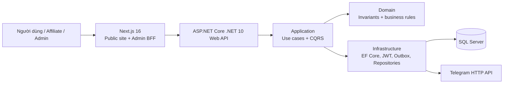

# CloudService Team 3 — MekongNode

[](https://github.com/MingJien/cloudservice-team3/actions/workflows/main.yml)

> Nền tảng SaaS mô phỏng quy trình tư vấn, đặt dịch vụ và vận hành cloud. Dự án được xây dựng theo Clean Architecture với .NET 10, Next.js, SQL Server, Docker Compose và quy trình kiểm thử tự động.

[Repository](https://github.com/MingJien/cloudservice-team3)

## Tổng quan

CloudService cung cấp website public và cổng quản trị cho các dịch vụ VPS, hosting, domain, email, SSL và hạ tầng liên quan. Mục tiêu của đồ án không chỉ là dựng giao diện đặt dịch vụ, mà là thể hiện một hệ thống có ranh giới kiến trúc rõ ràng, bảo vệ dữ liệu đầu vào và có thể chạy lại nhất quán bằng Docker.

| Năng lực | Điểm thể hiện |
|---|---|
| Kiến trúc | Clean Architecture 4 lớp: Domain, Application, Infrastructure, WebApi. |
| Nghiệp vụ | Báo giá, promotion, order tracking, affiliate, blog, hỏi–đáp, đánh giá sau đơn hoàn tất và quản trị nội dung. |
| Bảo mật | JWT + refresh-token rotation, RBAC, BFF HttpOnly cookie, rate limit, idempotency, audit log và optimistic concurrency. |
| Vận hành | Docker Compose, health check, transactional outbox Telegram, export Excel background job và GitHub Actions. |
| Chất lượng | xUnit/Moq/FluentAssertions, SQL Server Testcontainers, Jest/RTL, Playwright và k6. |

## Kiến trúc hệ thống



## Chức năng chính

- Public website: catalog, chi tiết gói, pricing/compare/advisor, promotion, blog, liên hệ và đăng ký Affiliate.
- Order: báo giá được backend xác thực, chống gửi trùng bằng idempotency key, mã tra cứu an toàn và quy trình trạng thái có audit.
- Admin: quản lý catalog, giá, khuyến mãi, đơn, nội dung, Affiliate, payout, export Excel và audit log.
- Affiliate Portal: referral last-click, commission ledger, tier, đối soát payout và dashboard cá nhân.
- Community: hỏi–đáp có phản hồi theo phân quyền; đánh giá chỉ phát sinh từ đơn đã hoàn tất, sau đó Admin chỉ có thể duyệt hoặc ẩn — không tự tạo/sửa đánh giá khách hàng.

## Công nghệ

| Layer | Stack |
|---|---|
| Backend | .NET 10, ASP.NET Core Web API, EF Core, MediatR, SQL Server |
| Frontend | Next.js 16, React, TypeScript strict, Tailwind CSS |
| Security | JWT, refresh-token rotation, PBKDF2, RBAC, rate limiting, HMAC |
| Quality | xUnit, Moq, FluentAssertions, Testcontainers, Jest, React Testing Library, Playwright, k6 |
| Delivery | Docker Compose, Nginx, GitHub Actions, Cloudflare Quick Tunnel demo |

## Cấu trúc repository

```text
cloudservice-team3/
├─ backend/                 # .NET 10 solution, 4 architecture layers và tests
├─ frontend/                # Next.js public site, admin console và BFF routes
├─ database/                # schema/reference data phục vụ tài liệu
├─ scripts/                 # deploy, secret check và load test k6
├─ nginx/                   # reverse proxy cho profile demo/production
├─ .github/workflows/       # CI release gate
├─ docker-compose.yml       # môi trường local
├─ docker-compose.prod.yml  # profile bàn giao qua Nginx
├─ Dockerfile.api
└─ Dockerfile.frontend
```

## Chạy nhanh với Docker

Yêu cầu: Docker Desktop đang chạy.

```powershell
Copy-Item .env.example .env
docker compose up --build
```

`docker-compose.yml` mở frontend trực tiếp tại cổng 3000 và mặc định gọi API
ở cổng 8080. Nếu API local chạy ở host hoặc cổng khác, đặt
`DOCKER_NEXT_PUBLIC_API_BASE_URL` trong `.env`; biến
`NEXT_PUBLIC_API_BASE_URL=/api` được dành cho profile production chạy qua
Nginx.

Các biến `DOCKER_NEXT_PUBLIC_API_BASE_URL`, `DOCKER_PUBLIC_BASE_URL` và
`DOCKER_SESSION_COOKIE_SECURE` chỉ áp dụng cho profile local; nhờ vậy một
`.env` có cấu hình HTTPS production không làm hỏng CORS hoặc phiên đăng nhập
khi chạy thử ở `http://localhost:3000`.

Sau khi container sẵn sàng:

| Thành phần | Địa chỉ |
|---|---|
| Website | http://localhost:3000 |
| Swagger | http://localhost:8080/swagger |
| API health | http://localhost:8080/health |
| API readiness + SQL Server | http://localhost:8080/health/ready |

Tài khoản demo chỉ dùng trong môi trường local: `admin / ad123` và Affiliate Bạc `affb / affb123`. Không dùng hoặc commit các credential này cho môi trường thật.


## Kiểm thử và CI

```powershell
dotnet restore backend/CloudService.sln
dotnet build backend/CloudService.sln -c Release --no-restore
dotnet test backend/CloudService.sln -c Release --no-build

cd frontend
npm ci
npm run lint
npm run typecheck
npm run test:coverage
npm run build
```

GitHub Actions chạy .NET build/test, SQL Server Testcontainers, frontend quality gate, Docker Compose smoke test, Playwright E2E và k6. Kết quả CI xanh là bằng chứng release.

Sau khi toàn bộ release gate thành công trên `main`, workflow publish hai image lên GHCR:

- `ghcr.io/mingjien/cloudservice-team3-api:sha-<commit>` và `:latest`
- `ghcr.io/mingjien/cloudservice-team3-frontend:sha-<commit>` và `:latest`

> GHCR package mới có thể mặc định ở chế độ private. Trước khi giảng viên pull image, mở từng package trong GitHub → **Package settings** → **Change visibility** → **Public**.

## Quy trình Git

| Nhánh | Mục đích |
|---|---|
| `main` | Bản tích hợp ổn định, dùng để nộp và trình diễn. |
| `develop` | Nhánh tích hợp trước release. |
| `feature/chien-core-landing` | Kiến trúc, core backend/frontend, database, auth và landing integration. |
| `feature/tan-admin-pricing` | Admin console, pricing, plans và promotions. |
| `feature/ly-orders-affiliate` | Orders, affiliate, dashboard và workflow liên quan. |
| `feature/thinh-landing` | Public landing và content screens. |

Quy trình: tạo feature branch từ `develop` → commit nhỏ, có ý nghĩa → pull request vào `develop`; khi release gate xanh, mở pull request từ `develop` vào `main`. PR vào `main` cần ít nhất một review độc lập và bốn check của release gate xanh. Nhánh `main` đã bật protection: không cho push trực tiếp, force-push hoặc xóa nhánh; review lỗi thời bị hủy và hội thoại phải được giải quyết trước khi merge.

## Team ownership

| Thành viên | Phạm vi đã thực hiện cuối |
|---|---|
| Chiến | Nền tảng, database, authentication, landing; hỗ trợ admin, affiliate và tích hợp cuối. |
| Tấn | Admin, pricing, service plans và promotions. |
| Ly | Orders, affiliate và dashboard. |
| Thịnh | Landing page và public content. |

