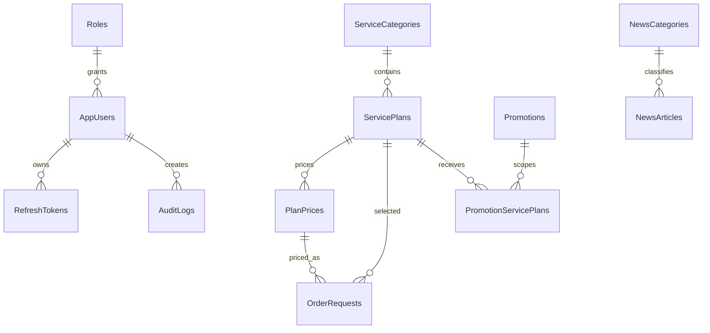

# DATABASE CONTRACT V1

Database: `CloudServiceDb` - SQL Server. File thực thi tham chiếu: `database/CloudServiceDb_v1.sql`.

## Nhóm bảng

| Nhóm | Bảng | Chủ module |
|---|---|---|
| Bảo mật | `Roles`, `AppUsers`, `RefreshTokens`, `AuditLogs` | Trưởng nhóm |
| Dịch vụ | `ServiceCategories`, `ServicePlans`, `PlanPrices`, `Promotions`, `PromotionServicePlans` | TV2 |
| Đơn/affiliate | `OrderRequests`, `AffiliateApplications` | Gói A |
| Nội dung | `NewsCategories`, `NewsArticles`, `Testimonials`, `ContactRequests` | Gói B |

## Quy tắc dữ liệu

- Tất cả thời gian lưu UTC bằng `datetime2(0)`; frontend đổi sang giờ Việt Nam khi hiển thị.
- Các bảng nghiệp vụ dùng `IsActive`/`IsPublished` để ẩn thay vì xóa cứng khi đã được tham chiếu.
- Tiền dùng `decimal(18,2)`, mã tiền `char(3)`, bản đầu dùng `VND`.
- `OrderRequests` lưu `PlanNameSnapshot`, `BillingCycleSnapshot`, `UnitPrice`, `DiscountAmount`, `EstimatedAmount` để lịch sử đơn không thay đổi khi admin đổi giá.
- Refresh token chỉ lưu `TokenHash`, không lưu token rõ.
- QR lưu `QrTargetUrl` và đường dẫn ảnh `QrCodePath`; không lưu QR thanh toán.
- Promotion không có dòng trong `PromotionServicePlans` được hiểu là áp dụng toàn bộ gói đủ điều kiện; nếu có liên kết thì chỉ áp dụng các gói được liên kết.

## Quan hệ chính

## Quy trình thay đổi schema

1. Người cần đổi ghi: bảng/cột, kiểu dữ liệu, null hay required, lý do, API/UI ảnh hưởng.
2. Trưởng nhóm kiểm tra trùng tên, quan hệ, dữ liệu cũ và duyệt.
3. Chủ module sửa entity/configuration trên feature branch.
4. Trưởng nhóm tạo migration tích hợp trên branch riêng sau khi các entity đã được merge.
5. Chạy migration từ database rỗng và database đang có dữ liệu seed trước khi merge.

Không chỉnh tay file migration đã được merge. Nếu sai, tạo migration sửa tiếp.

