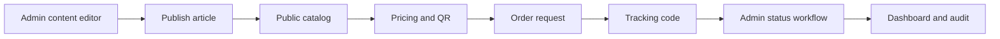

# CloudService — acceptance matrix và demo runbook

Tài liệu này là checklist nghiệm thu cho bản tích hợp. Mỗi mục phải được demo bằng dữ liệu local hoặc bằng test; không dùng ảnh chụp thay cho kết quả chạy được.

## Acceptance matrix

| Area | Evidence trong source | Cách demo/kiểm tra |
|---|---|---|
| Auth | `AuthController`, JWT service, refresh store, PBKDF2 hasher | Login, refresh, đổi mật khẩu; kiểm tra cookie không lộ token |
| Role | `[Authorize(Roles = "Admin")]` và policy Editor | Admin vào dashboard; Editor bị chặn endpoint admin-only |
| Catalog | `ServiceCatalogController`, repository, CRUD service | Tạo category/plan/price; disable; xem public catalog |
| QR | `SvgQrCodeGenerator`, `GET /api/service-plans/{id}/qr-code` | Quét QR hoặc dùng decoder để xác nhận URL hợp lệ |
| Pricing | `PricingService`, discount strategies | So sánh giá theo cycle và promotion; thử giới hạn promotion |
| Order | `OrderRequestsController`, order service/repository | Tạo order, nhận tracking code, chuyển trạng thái, export |
| Affiliate | affiliate controller/service/repository | Gửi application public, admin cập nhật trạng thái |
| Content | news category/article/testimonial/contact APIs | Tạo bài, publish, search/category/paging, xem public |
| Dashboard | dashboard controller/service/repository | Kiểm tra KPI tổng hợp và trạng thái đơn |
| Audit | audit store/service/controller | Thao tác admin rồi lọc audit theo action/entity |
| API contract | DTO validation, ProblemDetails, Swagger/OpenAPI | Gửi payload sai, kiểm tra 400 và `traceId`; mở Swagger |
| UI quality | public/admin layout, responsive Tailwind components | Desktop/mobile viewport; loading/error/empty state |
| Delivery | Dockerfiles, `docker-compose.yml`, GitHub Actions | `docker compose up --build`; CI chạy restore/build/test/lint |

## Demo data flow

## Demo script

1. Mở `/`, `/services`, `/pricing`, `/compare`, `/advisor`; ghi nhận các màn hình đều dùng API.
2. Mở `/services/{slug}`; kiểm tra giá theo chu kỳ, thông số và QR.
3. Mở `/order?planId={id}`; nhập dữ liệu hợp lệ, lưu mã tra cứu và mở `/orders/track/{code}`.
4. Vào `/admin/login` bằng tài khoản seed local. Mở dashboard và kiểm tra số liệu.
5. Trong Order requests, chuyển `New → Processing → Done` hoặc `New → Rejected`; thử transition không hợp lệ để kiểm tra ProblemDetails.
6. Export orders thành `.xlsx` và mở file bằng Excel/LibreOffice; kiểm tra header, số tiền và encoding tiếng Việt.
7. Trong Services, tạo một promotion hoặc sửa giá; xác nhận public quote thay đổi và audit có bản ghi.
8. Trong News, tạo category/article, publish; mở blog list, search và article detail.
9. Mở contact/affiliate admin để cập nhật trạng thái; kết thúc bằng audit log và Swagger.

## Release gate

- Không còn build warning/error mới.
- Backend test xanh; frontend lint, typecheck và production build xanh.
- Không commit `.env`, token, password, private key, dump dữ liệu thật.
- Không công bố số liệu khách hàng/SLA/chứng chỉ nếu chưa có nguồn xác minh.
- Mỗi PR có người review khác tác giả và ghi rõ cách test.
